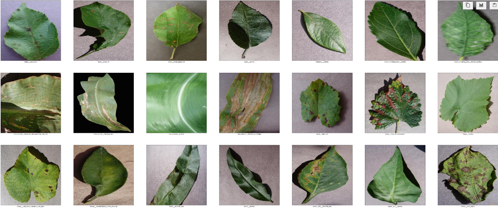
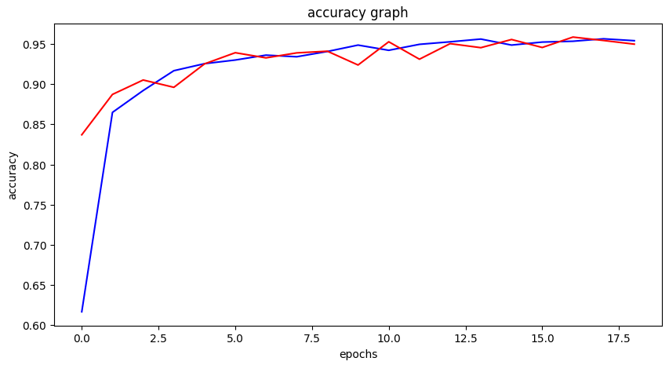
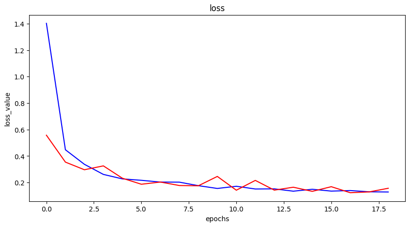

# Projeto de Detecção de Doenças em Plantações Tropicais 🌱

Este projeto utiliza técnicas de visão computacional para detectar doenças em plantações tropicais. O objetivo é criar um modelo que possa identificar condições adversas em imagens de plantas para apoiar a agricultura de precisão.



## Resultados

O treinamento foi relizado em um dataset com 100 mil imagens e após o treinamento, o modelo conta com uma acuracia de 93% nos testes.




## Tecnologias Utilizadas

- **Pandas**: Manipulação e análise de dados.
- **NumPy**: Operações numéricas e manipulação de arrays.
- **ResNet50**: Rede neural para Processamento e classificação das imagens.
- **TensorFlow/Keras**: Desenvolvimento e treinamento do modelo.
- **Scikit-learn**: Avaliação de modelos e métricas.
- **Matplotlib/Seaborn**: Visualização de dados.

- 
## Como Executar o Projeto

1. **Instale as Dependências**:
   ```bash
   pip install -r requirements.txt

2. **Dataset**
   - Caso queira utilizar o mesmo dataset para treino, siga as instruções do README encontrado em `./data/README.md` para ser capaz de uliza-lo
  
3. **Utilizando o modelo**
   - Para utilizar o modelo treinado, importe-o da pasta `./content/final_model`.
  
  
# Tropical Plantation Disease Detection Project 🌱

This project uses computer vision techniques to detect diseases in tropical plantations. The goal is to create a model that can identify adverse conditions in plant images to support precision agriculture.


## Results

The model was trained on a dataset with 100 thousand images and achieved an accuracy of 93% on the test set.


## Technologies Used

- **Pandas**: Data manipulation and analysis.
- **NumPy**: Numerical operations and array manipulation.
- **ResNet50**: Neural network for image processing and classification.
- **TensorFlow/Keras**: Model development and training.
- **Scikit-learn**: Model evaluation and metrics.
- **Matplotlib/Seaborn**: Data visualization.

## How to Run the Project

1. **Install Dependencies**:
   ```bash
   pip install -r requirements.txt

2. **Dataset**
   -If you want to use the same dataset for training, follow the instructions in the README found at `./data/README.md` to use it.

3. **Using the Model**
   -To use the trained model, import it from the `./content/final_model.h5` folder.
